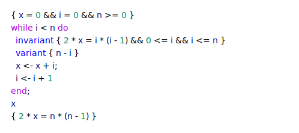
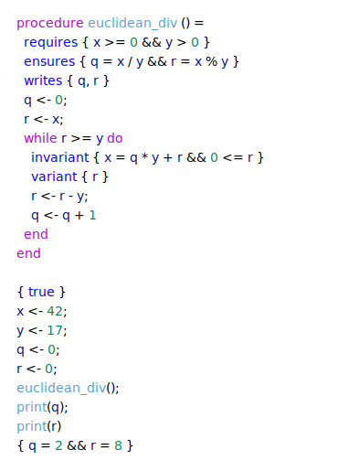
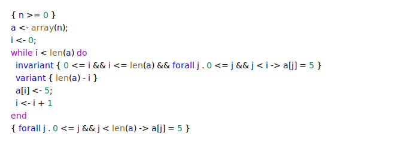
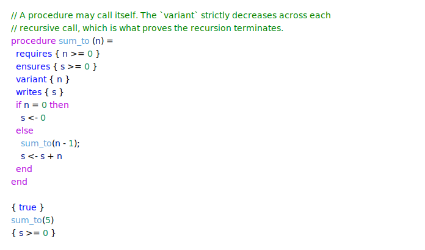

# Cavalry


Cavalry is a mini programming language of my own design where written programs can be "verified", i.e. the implementation of the program can be rigorously checked against its logical specification for correctness, without ever running the code.

Programs are built from procedures, loops, and bounded arrays, and their specifications quantify over program state with `forall` and `exists`. Verification covers not just partial correctness but termination too: loops and recursive procedures carry `variant` measures that prove they finish, giving total correctness. A verified program can then be compiled to a native executable.

Details about Cavalry and Hoare logic are in an article on my website [here](https://www.benmandrew.com/articles/cavalry).

## Requirements

The recommended way to get a working toolchain is [Nix](https://nixos.org/) with
[flakes enabled](https://nixos.wiki/wiki/Flakes): the bundled flake provisions
opam and the native libraries the project builds against. Setting the toolchain
up by hand instead needs:

- OCaml >= 4.14 and opam
- [Why3](https://www.why3.org/) with the [Alt-Ergo](https://alt-ergo.ocamlpro.com/) 2.4.3 SMT solver, used to discharge verification proof obligations

## Getting started

```bash
git clone git@github.com:benmandrew/cavalry.git
cd cavalry
```

### With Nix (recommended)

```bash
nix develop
```

Entering the dev shell for the first time bootstraps a local opam switch,
installs the project dependencies, and runs `why3 config detect` so Why3 can
find Alt-Ergo. A stamp file guards this so it only happens once per clone. If
you use [direnv](https://direnv.net/), `direnv allow` enters the shell (and runs
the bootstrap) automatically.

### Without Nix

Provision the opam switch and prover yourself:

```bash
opam install --deps-only --with-test .
why3 config detect  # let Why3 find the Alt-Ergo prover
```

## Running

Once the environment is ready, build the project and exercise a program:

```bash
dune build
# Verify [example.cav]
dune exec -- cav verify example.cav
# Run [example.cav]
dune exec -- cav run example.cav
# Compile [example.cav] to a native executable (gated on verification)
dune exec -- cav compile example.cav
```

By default the prover reasons over unbounded (mathematical) integers. Pass
`--machine-int` to `verify` — or `--native-int` to `compile` — to reason over
OCaml's 63-bit machine integers instead, in which case every arithmetic
operation must additionally be proven not to overflow.

## Testing

```bash
dune runtest
```

## Example programs

### Computing triangle numbers

A loop's `invariant` holds on entry and after every iteration, while its
optional `variant` — a non-negative measure that strictly decreases each
iteration — proves termination, giving total correctness.

<!-- snippet: triangle-numbers -->
<a href="docs/readme-snippets/snippets/triangle-numbers.cav">
  <picture>
    <source media="(prefers-color-scheme: dark)" srcset="docs/snippet-triangle-numbers-dark.svg">
    
  </picture>
</a>
<!-- /snippet -->

### Euclidean division procedure

Division `/` and modulo `%` are part of the logic, so the postcondition can
specify the loop's result directly in terms of them.

<!-- snippet: euclidean-division -->
<a href="docs/readme-snippets/snippets/euclidean-division.cav">
  <picture>
    <source media="(prefers-color-scheme: dark)" srcset="docs/snippet-euclidean-division-dark.svg">
    
  </picture>
</a>
<!-- /snippet -->

### Filling an array

Bounded arrays are created with `array(n)` (zero-initialised), indexed with
`a[i]`, and sized with `len(a)`. Specifications quantify over their contents
with `forall` and `exists`.

<!-- snippet: array-fill -->
<a href="docs/readme-snippets/snippets/array-fill.cav">
  <picture>
    <source media="(prefers-color-scheme: dark)" srcset="docs/snippet-array-fill-dark.svg">
    
  </picture>
</a>
<!-- /snippet -->

### Recursive procedure

Procedures may call themselves. A `variant` on the procedure — decreasing
across each recursive call — proves the recursion terminates.

<!-- snippet: recursive-procedure -->
<a href="docs/readme-snippets/snippets/recursive-procedure.cav">
  <picture>
    <source media="(prefers-color-scheme: dark)" srcset="docs/snippet-recursive-procedure-dark.svg">
    
  </picture>
</a>
<!-- /snippet -->
