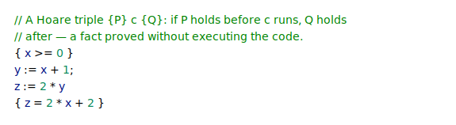
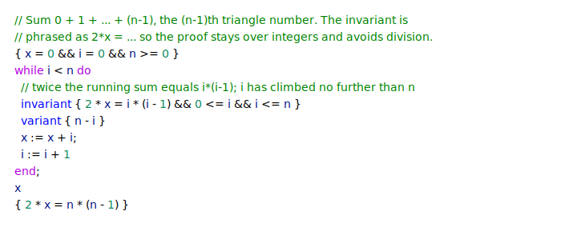
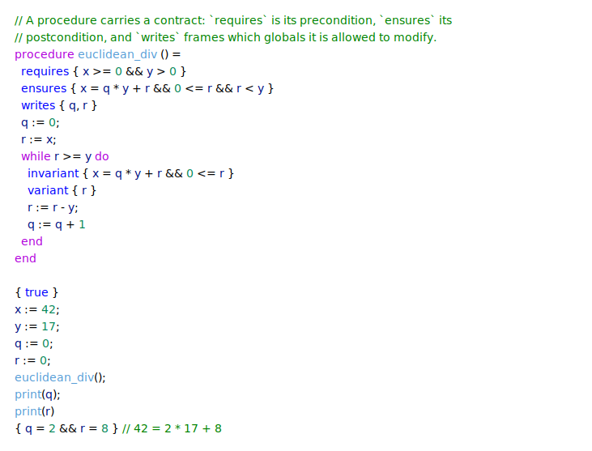

# Cavalry

Cavalry is an imperative programming language whose programs can be *verified*, i.e. the implementation of the program can be rigorously checked against its logical specification for correctness, without ever running the code.

Programs are built from integers, booleans, bounded arrays, loops, and procedures that can return values, and their specifications quantify over program state with `forall` and `exists`. Verification covers not just partial correctness but termination too: loops and recursive procedures carry `variant` measures that prove they finish, giving total correctness. A verified program can then be compiled to a native executable.

For the theory behind Cavalry and Hoare logic, see the [article on my website](https://www.benmandrew.com/articles/cavalry). Cavalry also runs entirely in the browser — the whole pipeline, Why3 and Z3 included, compiled to JavaScript and WebAssembly with no server round-trip; see [`web/`](web/README.md).

## Setup

You need OCaml >= 4.14 with opam, and [Why3](https://www.why3.org/) driving the
[Z3](https://github.com/Z3Prover/z3) 4.16.0 satisfiability-modulo-theories (SMT)
solver, which discharges the verification proof obligations. From a checkout of the repository:

**With Nix (recommended).** The bundled flake ([flakes enabled](https://nixos.wiki/wiki/Flakes))
provisions opam, the native libraries, and Z3:

```bash
nix develop
```

The first entry bootstraps a local opam switch, installs the dependencies, and
runs `why3 config detect` so Why3 can find Z3; a stamp file guards this so it
happens only once per checkout. With [direnv](https://direnv.net/), `direnv allow`
enters the shell and bootstraps automatically.

**Without Nix.** Install Z3 4.16.0 yourself (e.g. `brew install z3`), then
provision the switch and prover:

```bash
opam install --deps-only --with-test .
why3 config detect  # let Why3 find the Z3 prover
```

## Usage

```bash
dune build
dune exec -- cav verify example.cav    # check the pre/postconditions hold
dune exec -- cav run example.cav       # interpret the program
dune exec -- cav compile example.cav   # compile to a native executable (gated on verification)
dune runtest                           # run the test suite
```

By default the prover reasons over unbounded (mathematical) integers. Pass
`--machine-int` to `verify` — or `--native-int` to `compile` — to reason over
OCaml's 63-bit machine integers instead, in which case every arithmetic
operation must additionally be proven not to overflow.

## Examples

The three examples below cover the core constructs; the rest — returning
values, arrays with `forall`/`exists`, booleans, recursion, and how a failed
proof is reported — are in [Cavalry by example](assets/readme-snippets/EXAMPLES.md).
Each is a standalone program in [`assets/readme-snippets/snippets/`](assets/readme-snippets/snippets);
verify any of them with `dune exec -- cav verify <file>`.

### A Hoare triple

Verification rests on the Hoare triple `{P} c {Q}`: if precondition `P` holds
before command `c` runs, postcondition `Q` holds afterwards. The simplest
programs are straight-line assignments, with no loops or procedures.

<!-- snippet: hoare-triple -->
<a href="assets/readme-snippets/snippets/hoare-triple.cav">
  <picture>
    <source media="(prefers-color-scheme: dark)" srcset="assets/snippet-hoare-triple-dark.svg">
    
  </picture>
</a>
<!-- /snippet -->

### Computing triangle numbers

A loop's `invariant` holds on entry and after every iteration, while its
optional `variant` — a non-negative measure that strictly decreases each
iteration — proves termination, giving total correctness.

<!-- snippet: triangle-numbers -->
<a href="assets/readme-snippets/snippets/triangle-numbers.cav">
  <picture>
    <source media="(prefers-color-scheme: dark)" srcset="assets/snippet-triangle-numbers-dark.svg">
    
  </picture>
</a>
<!-- /snippet -->

### Procedures and contracts

A procedure is verified once against its contract: `requires` and `ensures` are
its pre- and postcondition, and `writes` frames the globals it may modify.
Callers reason from the contract alone, not from the body. Division `/` and
modulo `%` are part of the logic, so the postcondition can name the result
directly.

<!-- snippet: euclidean-division -->
<a href="assets/readme-snippets/snippets/euclidean-division.cav">
  <picture>
    <source media="(prefers-color-scheme: dark)" srcset="assets/snippet-euclidean-division-dark.svg">
    
  </picture>
</a>
<!-- /snippet -->
