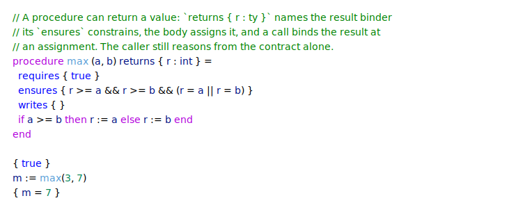
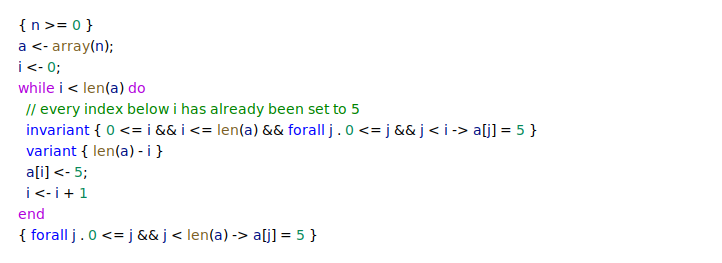
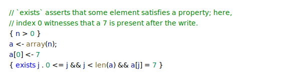
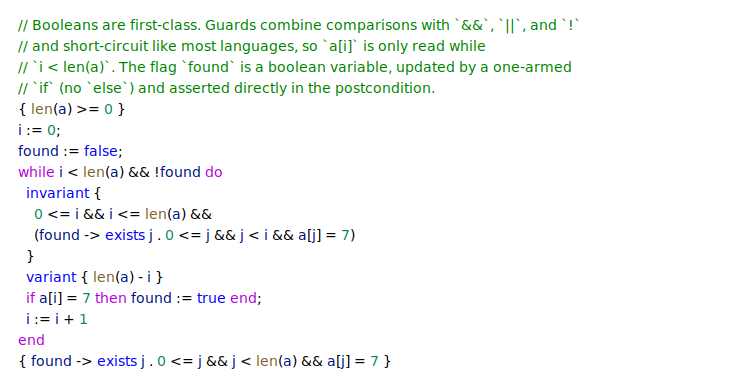
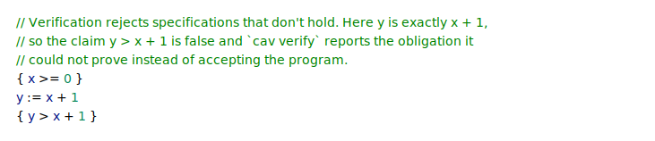

# Cavalry by example

Short, self-contained programs, each exercising one part of the language. Each
is a real file in [`snippets/`](snippets); verify any of them with `dune exec --
cav verify <file>` (see the [top-level README](../../README.md#usage) for setup).
The two marked ★ also appear on the front page.

## A Hoare triple

Verification rests on the Hoare triple `{P} c {Q}`: if precondition `P` holds
before command `c` runs, postcondition `Q` holds afterwards. The simplest
programs are straight-line assignments, with no loops or procedures.

<!-- snippet: hoare-triple -->
<a href="snippets/hoare-triple.cav">
  <picture>
    <source media="(prefers-color-scheme: dark)" srcset="../snippet-hoare-triple-dark.svg">
    
  </picture>
</a>
<!-- /snippet -->

## Computing triangle numbers ★

A loop's `invariant` holds on entry and after every iteration, while its
optional `variant` — a non-negative measure that strictly decreases each
iteration — proves termination, giving total correctness.

<!-- snippet: triangle-numbers -->
<a href="snippets/triangle-numbers.cav">
  <picture>
    <source media="(prefers-color-scheme: dark)" srcset="../snippet-triangle-numbers-dark.svg">
    
  </picture>
</a>
<!-- /snippet -->

## Procedures and contracts

A procedure is verified once against its contract: `requires` and `ensures` are
its pre- and postcondition, and `writes` frames the globals it may modify.
Callers reason from the contract alone, not from the body. Division `/` and
modulo `%` are part of the logic, so the postcondition can name the result
directly.

<!-- snippet: euclidean-division -->
<a href="snippets/euclidean-division.cav">
  <picture>
    <source media="(prefers-color-scheme: dark)" srcset="../snippet-euclidean-division-dark.svg">
    
  </picture>
</a>
<!-- /snippet -->

## Returning a value

A procedure can also return a value. A `returns { r : ty }` clause names the
result binder its `ensures` constrains; the body assigns it, and a call binds the
result at an assignment. The caller still reasons from the contract alone.

<!-- snippet: returning-value -->
<a href="snippets/returning-value.cav">
  <picture>
    <source media="(prefers-color-scheme: dark)" srcset="../snippet-returning-value-dark.svg">
    
  </picture>
</a>
<!-- /snippet -->

## Filling an array

Bounded arrays are created with `array(n)` (zero-initialised), indexed with
`a[i]`, and sized with `len(a)`. A `forall` in the invariant states what holds
of every element filled so far.

<!-- snippet: array-fill -->
<a href="snippets/array-fill.cav">
  <picture>
    <source media="(prefers-color-scheme: dark)" srcset="../snippet-array-fill-dark.svg">
    
  </picture>
</a>
<!-- /snippet -->

## Existential specifications

Where `forall` constrains every element, `exists` asserts that some element has
a property — here, that a value written into the array is still present.

<!-- snippet: array-exists -->
<a href="snippets/array-exists.cav">
  <picture>
    <source media="(prefers-color-scheme: dark)" srcset="../snippet-array-exists-dark.svg">
    
  </picture>
</a>
<!-- /snippet -->

## Booleans and compound guards

Booleans are first-class values. A guard may combine comparisons with `&&`, `||`,
and `!`, and short-circuits like most languages — so an array read stays inside
its bounds. A boolean variable holds a flag, appears as a bare proposition in a
specification, and an `if` may drop its `else` when the missing branch is a no-op.

<!-- snippet: booleans -->
<a href="snippets/booleans.cav">
  <picture>
    <source media="(prefers-color-scheme: dark)" srcset="../snippet-booleans-dark.svg">
    
  </picture>
</a>
<!-- /snippet -->

## Recursion ★

Procedures may call themselves, reasoning from their own contract at the
recursive call. A `variant` on the procedure — decreasing across each recursive
call — proves the recursion terminates, just as it does for a loop.

<!-- snippet: recursive-procedure -->
<a href="snippets/recursive-procedure.cav">
  <picture>
    <source media="(prefers-color-scheme: dark)" srcset="../snippet-recursive-procedure-dark.svg">
    
  </picture>
</a>
<!-- /snippet -->

## Catching a bad specification

When a program does not meet its specification, verification fails and reports
the obligation it could not prove instead of accepting the program. The same
check catches arithmetic overflow under `--machine-int`.

<!-- snippet: failing-spec -->
<a href="snippets/failing-spec.cav">
  <picture>
    <source media="(prefers-color-scheme: dark)" srcset="../snippet-failing-spec-dark.svg">
    
  </picture>
</a>
<!-- /snippet -->
